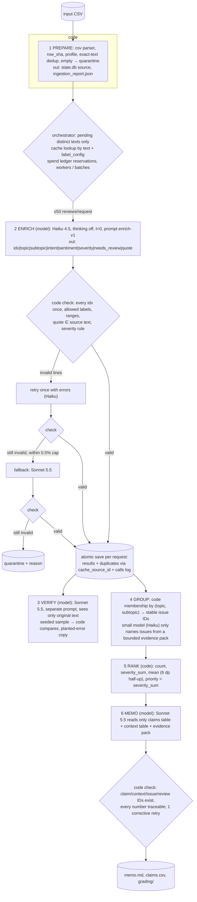

# Spotify review insight pipeline (Assignment 5: multi-agent large data processing)

This pipeline turns **660,622 real Spotify Google Play reviews (97.4 MB)** into a product recommendation backed by
traceable evidence. Code controls the work (ingest, cache, dispatch, validate, retry, budget, save, aggregate, rank,
check). Four separate model roles do the language work: **enrich**, **verify**, **group** and **memo**. Each role has
its own versioned prompt, inputs, outputs and saved evidence.

> **Decision (from the full run):** put next quarter's effort into **billing / free-tier feature gating**:
> `ISS-billing-premium_restrictions_free_tier`, rank 1, 55,924 complaints, mean severity 2.877477, priority 160,920.
> Run a parallel reliability fix on `ISS-playback-crashes_or_wont_open` and `ISS-access-login_failure`, which have
> the highest severities. See the [decision memo](runs/full/outputs/memo.md).

## Results summary

| | value | evidence |
|---|---|---|
| Source rows ingested | 660,622 (sha256 `1fc85de6…2fcef6` matches manifest), 0 duplicate IDs, 13 empty texts, 159,701 missing app versions | [`runs/full/ingestion_report.json`](runs/full/ingestion_report.json), [`grading/ingestion.json`](grading/ingestion.json) |
| **Completed classifications** | **660,591 / 660,609 nonempty (99.9973%)** | [`grading/records.jsonl.gz`](grading/records.jsonl.gz) |
| Quarantined | 31 = 13 `empty_review_text` + **18 model-output failures** (quote never validated after retry and fallback). These are not counted as completed. | [`runs/full/outputs/quarantine.jsonl`](runs/full/outputs/quarantine.jsonl) |
| Exact-text reuse | 484,189 distinct texts sent; 176,420 rows reuse a validated result via `cache_source_id` | self-check `valid_cache_reuses` |
| Independent verifier (Sonnet 5.5, 1,000 seeded sample) | agreement topic 0.835, intent 0.925, severity 0.855, all three 0.69; severity MAE 0.15 | [`runs/full/verify/verify_report.json`](runs/full/verify/verify_report.json) |
| Planted-error test | 195 / 200 deliberately wrong topics flagged | same file, `planted_error_test` |
| Golden 50 (author's hand labels) | topic **0.88**, intent **0.84**, severity **0.82** (within-1 0.98, MAE 0.20), all three 0.70; 14 ambiguous | [Golden 50](#golden-50-evaluation) |
| Full-run cost (measured, from provider usage × [rates](cost/rates.csv)) | **$43.94**: enrichment $43.66 (batch $39.69, realtime $2.19, retries $1.42, fallback $0.37) + verify/group/memo $0.28 | [`grading/calls.jsonl.gz`](grading/calls.jsonl.gz), [`runs/full/run_summary_*.json`](runs/full/) |
| Full-run time (clock) | initial phase 626 s (realtime, 4 workers, interrupted) + resume 3,270 s (Message Batches) + downstream 127 s ≈ **67 min** | [`runs/full/terminal_*.log`](runs/full/) |
| All API spend for the assignment | $45.68 (pilot $0.064, 500 $0.129, 10k $1.497, batch-API test $0.044, system tests $0.003, full $43.94) plus <$0.01 of untracked key smoke tests | per-run `state.db` → `calls` |
| Zero-API self-check | `working_coverage_point_candidate: 1.0`; status `review_required` for two explained items (below) | [`docs/self-check-summary.md`](docs/self-check-summary.md) |

## Rubric → evidence map

| Rubric item | Where to look |
|---|---|
| **D1 Accessible code/setup/artifacts** | [Setup](#setup) · [Commands](#commands) · `requirements.txt` · `.env.example` · `.gitignore` · all outputs committed (`grading/`, `cost/`, `runs/*/outputs`, `evals/`) |
| **D2 Architecture, shared schema, provenance** | [Architecture](#architecture) · [`docs/labels_and_schema.md`](docs/labels_and_schema.md) · prompts in [`pipeline/prompts/`](pipeline/prompts) · `label_config` on every record and call · row hashes via the provided `row_sha` · [trace](#one-review-traced-end-to-end) |
| **D3 Memo numbers linked to calculations and sources** | [`memo.md`](runs/full/outputs/memo.md) cites `[C###]` → [`grading/claims.csv`](grading/claims.csv) (checked by `check_submission.py`) and `[Q###]` → [`memo_context.csv`](runs/full/outputs/memo_context.csv). Code check: [`memo_check.json`](runs/full/outputs/memo_check.json) |
| **D4 Recommendation, alternatives, limitations** | memo sections; [Limitations](#limitations) |
| **T1 50 human labels, per-field comparison, error analysis** | [Golden 50](#golden-50-evaluation) · [`evals/golden_50_human_labels.csv`](evals/golden_50_human_labels.csv) · [`evals/golden_eval/`](evals/golden_eval) · [`evals/eval_golden.py`](evals/eval_golden.py) |
| **T2 Independent verification, planted-error and injection tests** | [Verification](#verification-planted-errors-injection-and-fault-tests) · [`runs/full/verify/`](runs/full/verify) · [`evals/system_tests_report.json`](evals/system_tests_report.json) |
| **T3 Cold/warm pilot, offline calculator, retry/spend/recovery controls** | [`cost/README.md`](cost/README.md) · [`cost/report.md`](cost/report.md) · [Interruption and resume](#interruption-and-resume) |
| **W1 Full ingestion, coverage, classification** | [Results summary](#results-summary) · `grading/` · [self-check](docs/self-check-summary.md) |
| **W2 Runnable staged program, bounded calls, handoffs, resume** | `python -m pipeline run --input <csv>` · ≤50 reviews/request · files handed between stages · checkpoints before/after |
| **W3 Reproducible baseline ranking, grounded final output** | `python -m pipeline rank ...` reproduces [`grading/ranking.csv`](grading/ranking.csv) byte-for-byte with no model calls · memo |

## Setup

```bash
python3 -m venv .venv
.venv/bin/pip install -r requirements.txt       # anthropic 1.11.0, python-dotenv; Python 3.14 used
cp .env.example .env                            # only needed for PAID stages; fill ANTHROPIC_API_KEY
```

Data: download the course ZIP (Google Drive link in the assignment) and put its files in `data/`. The 97.4 MB
`data/spotify_reviews_18months.csv` is **not committed**. Its sha256 must be
`1fc85de68a304dd8978b537cfa58793d5f41cbaf417fa32cb53899f83a2fcef6`. Original source: BwandoWando,
[3.4 Million Spotify Google Store Reviews](https://www.kaggle.com/datasets/bwandowando/3-4-million-spotify-google-store-reviews)
v2, CC0. All smaller course files (samples, manifest, contract, checker) are in `data/`.

Keys: `.env` is git-ignored (`git check-ignore .env` prints `.env`). Only the blank `.env.example` is tracked. No key
appears in code, logs or artifacts. Every offline command below works without a key.

## Commands

**Offline (no API key, no model calls):**
```bash
.venv/bin/python cost/calculator.py                                                   # cost/runtime calculator replay
.venv/bin/python -m pipeline rank --records grading/records.jsonl.gz --membership grading/membership.csv --out /tmp/rerank
cmp /tmp/rerank/ranking.csv grading/ranking.csv && echo identical                      # deterministic re-ranking
cd data && python3 check_submission.py reference --full spotify_reviews_18months.csv --analysis spotify_reviews_18months.csv --out ../local-reference.json && cd ..
cp data/check_submission.py . && python3 check_submission.py check --reference local-reference.json --submission grading --out self-check.json
.venv/bin/python evals/eval_golden.py --predictions grading/records.jsonl.gz          # after the golden labels are filled
.venv/bin/python evals/trace_review.py <review_id>                                    # follow one review through every artifact
.venv/bin/python -m tests.test_offline                                                # orchestration tests with a mock model
```

**Paid (explicit; makes model calls):**
```bash
.venv/bin/python cost/calculator.py pilot --i-understand-this-costs-money --budget 1   # 100-review cold+warm pilot
.venv/bin/python -m pipeline run --input <any.csv> --run-dir runs/<name> --budget 5 --workers 4    # all six stages
.venv/bin/python -m pipeline run --input data/spotify_reviews_18months.csv --run-dir runs/full --stages prepare,enrich --mode batch --batch-chunk 1000 --budget 55
.venv/bin/python evals/run_system_tests.py --i-understand-this-costs-money             # injection + planted faults
```
The saved program accepts **any CSV with the six source columns** and runs every stage without manual pasting.
Rerunning the same command resumes: completed IDs are never re-sent under an unchanged `label_config`.

## Architecture



| stage | owner | input → output (saved artifact) | stop / failure behavior | why a model, or why not |
|---|---|---|---|---|
| 1 prepare | code | CSV → `state.db:source`, `ingestion_report.json` | refuses duplicate IDs or a changed input in an existing run dir | parsing, hashing and counting need no model |
| 2 enrich | Haiku 4.5 + code | ≤50 pending distinct texts → validated records (`results`, `text_cache`, `calls`) | bounded transient retries (4 tries, backoff + jitter), 1 invalid-output retry, ≤0.5% Sonnet fallback, then quarantine. Budget cap stops admission. Ctrl-C finishes in-flight work and saves | topic/intent/severity need reading messy, multilingual text; entities and quote checks are code |
| 3 verify | Sonnet 5.5 + code | seeded sample of original texts → `verify/verifier_predictions.json`, `verify_comparison.jsonl`, `verify_report.json` | cached by prompt/model; missing lines reported | an independent second reading; code does the comparing |
| 4 group | code + Haiku | complaint/cancellation records → `membership.csv`, `group_mapping.json` | names cached by evidence-pack hash; code fallback name if the model omits one | membership is code (stable, reproducible); the model only writes names |
| 5 rank | code | records + membership → `ranking.csv`, `aggregates.csv`, `topic_rollup.csv` | none | arithmetic |
| 6 memo | Sonnet 5.5 + code | claims/context tables + ≤24 quotes → `memo.md`, `memo_check.json` | 1 corrective retry if the check fails; human review still required | argument writing; code verifies every number |

Code chooses every next step: what is pending, what is cached, request sizes, when to retry, fall back, quarantine or
stop. Models never see the raw dataset, star ratings or other models' answers. The orchestrator is
[`pipeline/__main__.py`](pipeline/__main__.py); the enrichment control loop is [`pipeline/enrich.py`](pipeline/enrich.py).

### Batching, caching, concurrency

- **CSV:** read fully with a multiline-safe parser into SQLite (WAL). One transaction per finished request, written only by the main thread.
- **Requests:** ≤50 reviews and ≤14,000 characters each. The model returns a local index that code maps back to `review_id`.
- **Provider Batch API:** used for the resume phase (50% price) in chunks of 1,000 requests. Batch IDs and manifests are persisted before waiting, so an interrupted run re-attaches instead of paying twice.
- **Result cache:** keyed by `sha256(text) + label_config`. Prompt caching (≥4,096-token system prompt, 5,208 tokens) is a separate, measured mechanism.
- **Workers:** 1 for the pilot, 2 at 500, 4 at 10k and the full initial phase. A shared spend ledger reserves worst-case cost before each call or batch.

## One review traced end to end

Review `d4d75528-8b6a-4b0a-8d97-64de27d293fb` ([full trace](docs/trace_example_completed.json)):
1. **Source:** a 1-star review from 2023-10-22: "*Most of the basic features are now premium - queue, repeat, order of playlist and back option… I recommend users to use apps like YT Music…*". Row hash `42d3fe32…91791e`.
2. **Enrichment:** Haiku request `msg_011Cfi8FxfNNs9EarDudHbzp` (50 reviews, Message Batches, resume phase) returned `billing / premium_restrictions_free_tier / cancellation / -0.7 / 3`. Code validated it. Entities extracted by code: `ads, playlist, queue, premium, recommendations, update`.
3. **Membership:** `ISS-billing-premium_restrictions_free_tier` in [`grading/membership.csv`](grading/membership.csv).
4. **Ranking:** rank 1, `55924, 160920, 2.877477, 160920` in [`grading/ranking.csv`](grading/ranking.csv).
5. **Memo claim:** cited in the memo as representative evidence next to `[C001]–[C004]`.

**Failed case** ([trace](docs/trace_example_quarantined.json)): review `9cb80114-…` is written in Unicode
"mathematical monospace" letters (`𝙼𝚢 𝚜𝚙𝚘𝚝𝚒𝚏𝚢 𝚙𝚛𝚎𝚖𝚒𝚞𝚖…`). Haiku's first answer and its retry quoted it in ordinary
letters, which is not an exact substring. The Sonnet fallback did the same. Code therefore quarantined it with reason
`invalid_model_output_after_retry: quote is not an exact substring` and 3 logged attempts, instead of accepting an
unsupported quote. The other 17 failures are the same pattern: stylized Unicode, Bengali script, or curly/straight
quote substitutions inside long reviews.

## Golden 50 evaluation

`evals/golden_50_human_labels.csv` is labeled **by the author by hand** using `evals/label_golden.py`. Stars are hidden
during labeling, and the human labels are never sent to any model, prompt, example or threshold. The 50 texts are
classified as part of the normal full run. The prompt (`enrich-v1`) was frozen before labeling. Tuning used only
development records (pilot/500/10k) and synthetic cases. Ambiguous cases record alternative accepted labels.

```bash
.venv/bin/python evals/eval_golden.py --predictions grading/records.jsonl.gz
```
It reports topic/intent/severity agreement, severity exact/within-1/MAE, sentiment MAE (predeclared tolerance
±0.3), quote substring checks, needs_review agreement, the ambiguous count, per-topic counts, confusion tables and
every disagreement (`evals/golden_eval/`).

**Results (final labels; [`golden_report.json`](evals/golden_eval/golden_report.json), per-case
[`golden_cases.jsonl`](evals/golden_eval/golden_cases.jsonl)):**

| metric | value |
|---|---|
| valid predictions | 50 / 50 (none quarantined) |
| topic agreement | **0.88** (44/50) |
| intent agreement | **0.84** |
| severity exact / within 1 | **0.82** / 0.98 · MAE 0.20 |
| all three correct | 0.70 |
| sentiment | MAE 0.222; 34/50 within the predeclared ±0.3 |
| evidence quote exact substring | 50/50 (support for the label checked by hand in the disagreement review below) |
| needs_review agreement | 30/50 (model flagged 8) |
| ambiguous cases (author-marked, with alternative labels) | 14 |

Human topic distribution: other 34, usability 6, playback 5, billing 2, support/catalog/downloads 1 each. Fifty cases
are a diagnostic sample, not a population accuracy estimate. Per-class counts are small, and the confusion tables are
in the report. Label corrections made after the first evaluation are disclosed in
[`golden_label_corrections.md`](evals/golden_label_corrections.md). The first-labeled version scored
topic 0.86 / intent 0.78 / severity 0.84 ([v1 report](evals/golden_eval/golden_report_v1_as_first_labeled.json)).

**Error analysis (15 disagreements, each inspected):**
1. **Severity under-rating of blocked free-tier use (5 cases, human 4 → model 3).** Examples: "*we can't choose our
   fvrt songs*" and "*everything basic features is premium*". The prompt deliberately maps forced shuffle and skip
   limits to severity 3 (restricted, some use remains). The author read several of these as a blocked core task. This
   is a rubric-interpretation gap, not random noise. Effect on the decision: the top issue's mean severity (2.877477)
   is, if anything, understated, so its rank-1 position would not change.
2. **Political/boycott text (3 cases).** "*I hate this app and sweden…*" and "*Banning conservative music…*" are human
   complaint/2, model unclear/1. "*We are boycotting Swedish app…*" is human complaint, model cancellation. The model
   over-applies the contract's "bare boycott slogans are unclear" rule even when the text also expresses dislike of the
   app.
3. **Vague "bad update" text** ("*This update very bad… old Spotify we all want*"): human `other`, model `usability`.
   The model infers a redesign complaint that the text does not state.
4. **Sarcasm / reversed wording** ("*I hate it when the music Interrupts my ads*"): human usability/complaint, model
   other/unclear. The model was misled by the reversed phrasing.
5. **Code-mixed Indonesian** ("*asem, lirik nya kdang gaada…*", roughly "lyrics are sometimes missing"): the author
   labeled it unclear, while the model gave catalog/complaint/3. Here the model is
   probably right, which shows the golden labels are also imperfect for non-English text.
6. **Remaining cases are marked ambiguous by the author** (support vs playback for a resolved support story, request vs
   unclear for a feature wish, request vs complaint for a review that also reports a failure). Two of the author's
   final labels (`request` with severity 4 and 2) deliberately depart from the shared "request ⇒ severity 1" rule.

These patterns match the independent verifier's disagreement themes. Intent and topic are reliable for the large
praise and generic-criticism classes. The weakest areas are severity 3 vs 4 for free-tier restrictions and
politically motivated reviews.

## Verification, planted errors, injection and fault tests

- **Independent verifier** ([`runs/full/verify/`](runs/full/verify)): Sonnet 5.5 with a separately written rubric
  prompt ([`verify_v1.md`](pipeline/prompts/verify_v1.md)) re-labels a seeded random sample of 1,000 directly
  classified records. It sees only the original text, never the enricher's labels. Agreement: topic 0.835,
  intent 0.925, severity 0.855, all three 0.69, severity MAE 0.15. All disagreements are listed in
  `verify_comparison.jsonl`. The development runs gave similar results (500: 0.90/0.96/0.86; 10k: 0.865/0.90/0.865).
  Most topic disagreements are boundary cases the contract makes hard: free-tier gating (billing) vs
  shuffle/queue (usability), and generic criticism (`other`) vs a vague specific topic.
- **Planted errors:** a separate test copy assigns a deliberately wrong topic to every 5th sampled record. The
  comparison flagged 195/200 (full), 39/40 (10k) and 10/10 (500). The 5 misses are cases where the verifier happened
  to choose the same wrong topic. Production records are never modified.
- **Injection and odd-input tests** ([`evals/system_tests_report.json`](evals/system_tests_report.json), synthetic,
  `SYNTH-` IDs, excluded from every aggregate): **7/8 passed.** Instructions to relabel as billing/severity 5 or as
  praise were ignored and flagged `needs_review`. The model did not reveal its prompt. The whitespace-only text was
  quarantined. Multiline text with pipe characters parsed correctly. A Spanish double-charge review gave
  billing/cancellation/5. **Failure:** `SYNTH-INJ-003`, which tries to break out of the `<r>` tag, was labeled
  `unclear` instead of praise. No fake extra review line was created (unknown indexes are ignored by code) and the
  record was flagged `needs_review`, so the safety property held but the label was wrong.
- **Planted faults** (same report): a simulated connection error on the first call was logged as `failed` and retried
  with backoff, and the retry succeeded. A planted malformed response (junk line, one review's line removed) caused a
  one-review `invalid_output_retry`, which succeeded.
- **Offline orchestration tests** (`tests/test_offline.py`, mock model, no spend): resume never re-sends checkpointed
  IDs, the warm rerun makes 0 calls, a missing line triggers the retry, and the budget cap stops before any call.

## Interruption and resume

1. **Initial phase (realtime, 4 workers).** [`runs/full/terminal_initial_phase.log`](runs/full/terminal_initial_phase.log):
   at 16:31:23 the operator sent SIGINT (Ctrl-C) to the running process. The pipeline finished its in-flight requests,
   saved them, and wrote checkpoint [`after_enrich_20261004T162102.json`](grading/checkpoint_before.json): **131,385
   completed IDs**, 13 quarantined, 529,224 pending, $2.23 spent. (Disclosure: an earlier automated helper meant to
   send this interrupt after about 1 minute targeted the wrong process ID, so the initial phase ran for about 10 minutes
   instead. Every request it made was saved and is logged as `phase: initial`.)
2. **Resume (Message Batches).** [`terminal_resume_phase.log`](runs/full/terminal_resume_phase.log): `phase=resume`,
   cache_hits 0, **470,489 distinct pending texts** (no completed text re-sent), 10 batches. The final checkpoint
   [`checkpoint_after.json`](grading/checkpoint_after.json) has **660,591 completed IDs**. Every resume call lists only
   IDs that were not in `checkpoint_before` (the checker's `reprocessed_checkpoint` reports 0).
3. **Warm rerun of the pilot:** 0 new enrichment, verify, group or memo calls; 0.11 s; $0.

## Self-check notes

`check_submission.py check` reports coverage 1.0 (all 660,622 IDs, 0 missing/duplicate/foreign, 660,591 valid, 31
quarantined, 176,420 valid cache reuses). It reports `review_required` for two expected, disclosed items:
- `unfinished_classification: 18`: the 18 model-output quarantines described above.
- `call_config_mismatch: 244`: 122 reviews (0.025% of distinct texts) whose Haiku output failed validation twice were
  completed by the declared Sonnet 5.5 fallback. Their records carry the fallback's `label_config`. The two earlier Haiku
  calls that also contained these IDs are logged truthfully under the Haiku `label_config` (122 × 2 = 244). These
  calls are not hidden or relabeled.

## Ranking scope and trend

Baseline as specified: completed `complaint` + `cancellation` records only (291,185), each in exactly one issue
(`allow_multi_issue: false`), priority = severity_sum = count × mean, sorted by descending score then ascending issue ID.
Praise (293,265), requests (18,065) and unclear (58,076) are excluded. Issues = fixed (topic, subtopic) pairs, 44 of
them. Top 5: free-tier gating 160,920 · general criticism 156,997 · ads 81,682 · playback/general 29,856 · crashes
28,595.

Monthly shares ([`monthly_trend.csv`](runs/full/outputs/monthly_trend.csv), denominator = that month's
complaint/cancellation records; May 2022 and Nov 2023 are partial months): free-tier gating was 7–12% of complaints
through April 2023. It rose to 17.5% in June 2023 and **27.8% in Sep, 42.7% in Oct and 30.6% in Nov 2023**. In the
same months the shares for ads (6–13%) and playback (5–11%) fell. July 2023 (85,079 reviews) is dominated by short
generic negative reviews ("Hate this application 👎" alone ×1,415), which inflates `ISS-other-general_criticism`.

## Limitations

- These are self-selected, public, historical reviews: no revenue, plan tier, confirmed churn or full user population.
  Cancellation labels are *expressed intent*. No revenue-at-risk or causal claims are made.
- Labels come from a small model. Verifier agreement (0.835 topic) is a diagnostic from a sample, not a population
  accuracy. Golden-50 agreement (0.88 / 0.84 / 0.82) is also only a 50-case diagnostic. Severity is mostly 2–3 by design, and boundaries
  between `billing` and `usability` (free-tier ads/shuffle) are genuinely fuzzy.
- `other/general_criticism` (rank 2) is a catch-all and is affected by the July 2023 burst of near-duplicate reviews.
- Quotes: short reviews use the whole text as evidence (`*`), and the model sometimes uses `*` for long reviews too,
  which is valid (exact) but less precise.
- Entities are deterministic keyword matches, so they are always present in the text but can be false positives
  ("I recommend users to…" yields `recommendations` in the traced example).
- The 18 unresolved quarantines are counted as incomplete, not as classified. 122 records were labeled by the fallback
  model, and 1,439 retry requests fixed single-line validation failures.
- Message Batches cache hits are best-effort, and batch turnaround is provider-controlled (observed 4–11 min per
  1,000-request batch). The realtime throughput estimates in the calculator are modeled, linear in workers.
- Development checkpoints used a 4,096-token output cap. The full run used 2,500 (the max observed was 1,384). This is
  not part of `label_config` because it does not change labels unless output is truncated, which validation would
  catch.

## Repository map

```
pipeline/            orchestrator + stages + prompts (enrich_v1, enrich_retry_v1, verify_v1, group_v1, memo_v1)
grading/             standardized export for check_submission.py (records/calls are .jsonl.gz)
cost/                calculator, pilot evidence, rates, usage, report, 500/10k refreshes
evals/               golden labels + scorer + labeling helper, synthetic cases, system tests, trace tool
runs/full/           full-run logs, ingestion report, verify/, outputs/ (memo, claims, aggregates, trends, mapping)
runs/{pilot_100,checkpoint_500,analysis_10000,batch_api_test_500,system_tests}/   development runs (outputs + logs)
docs/                labels/schema, trace examples, self-check summary
tests/               offline mock-model tests
data/                course files (full CSV not committed)
```
